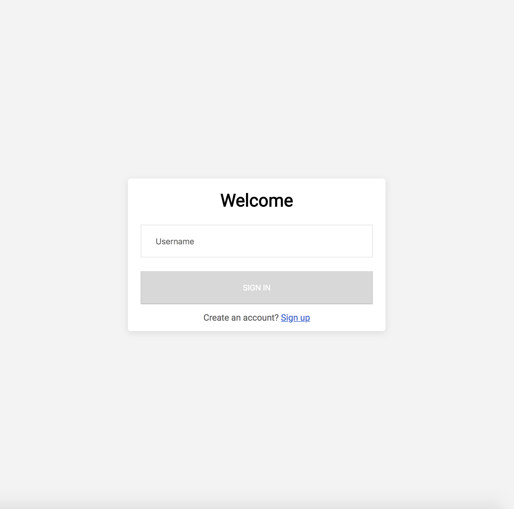
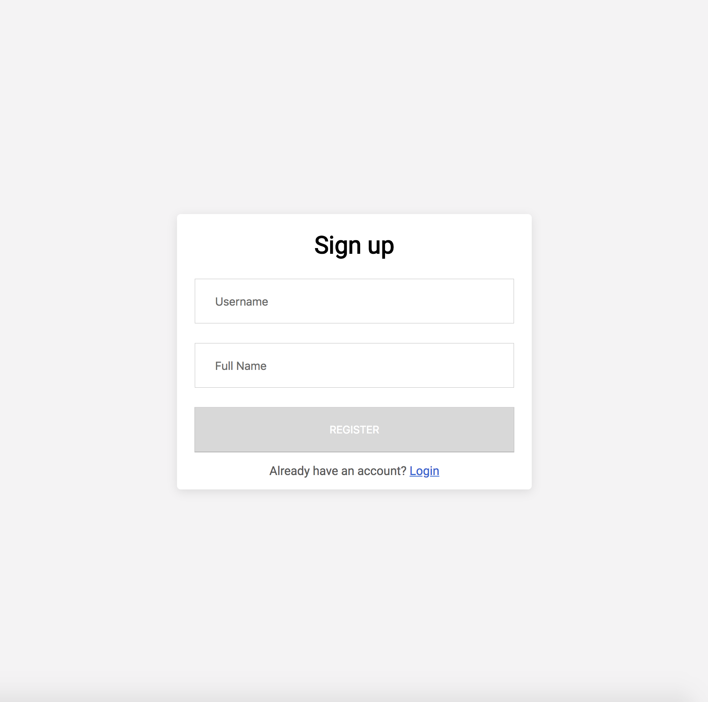
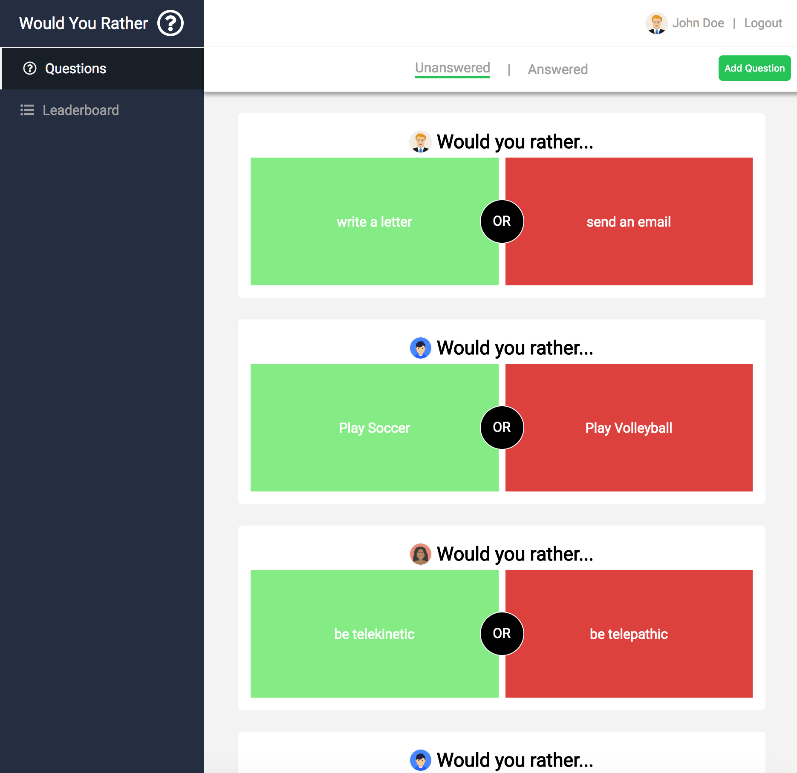
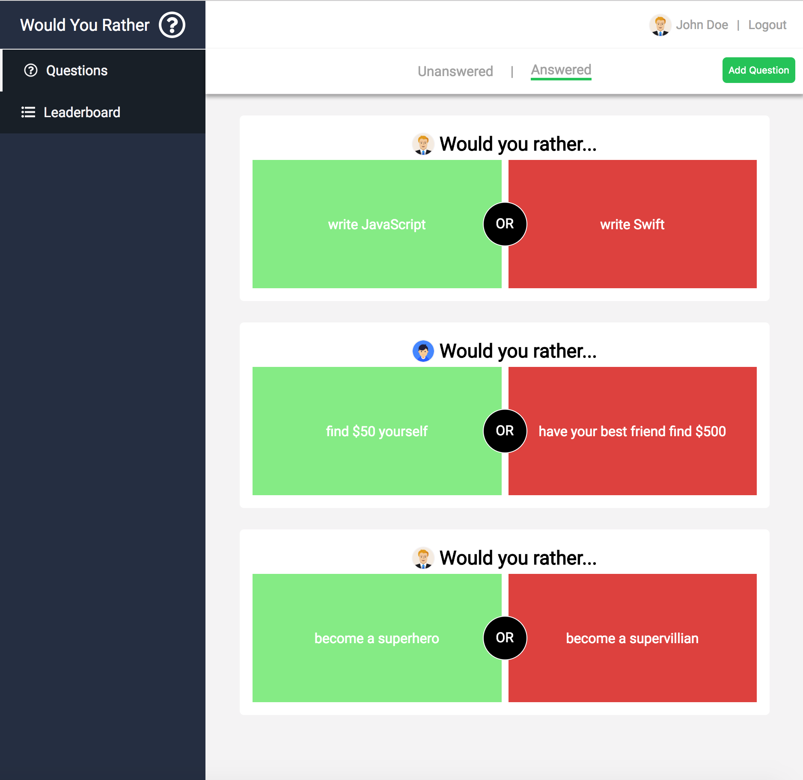
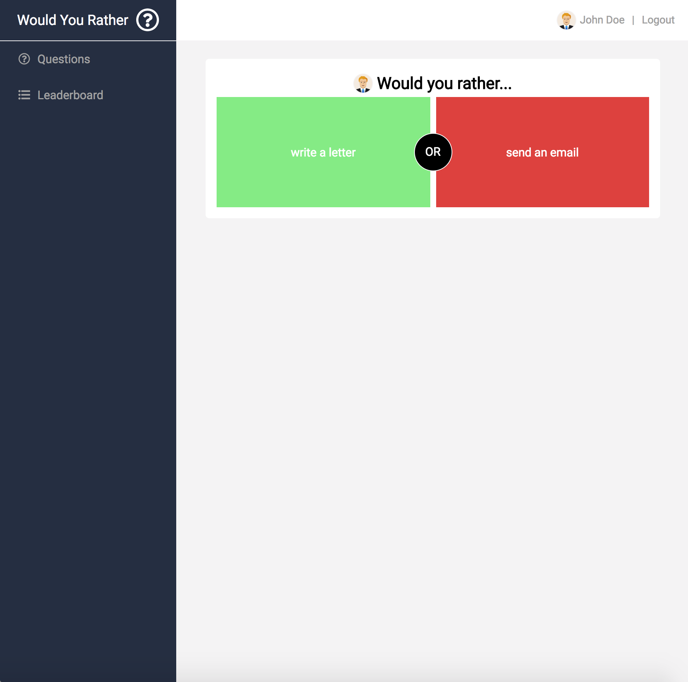
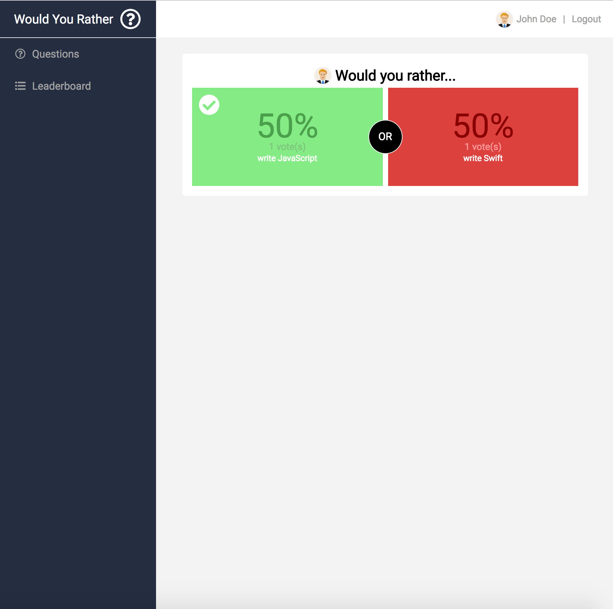
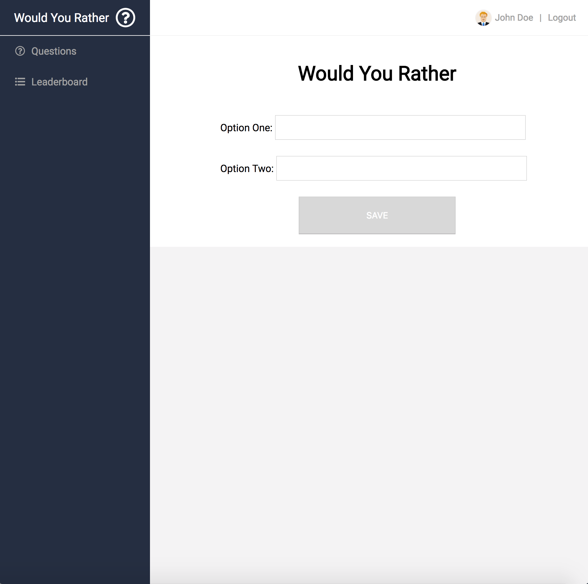
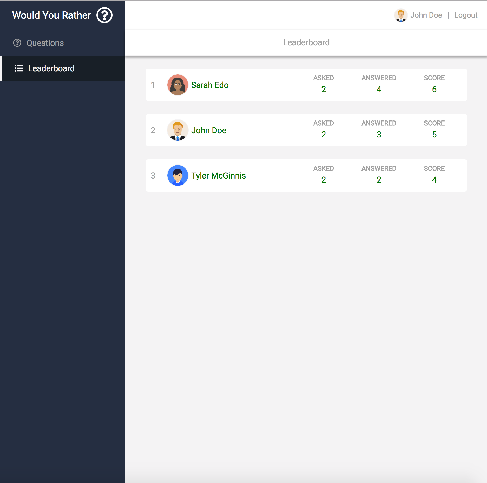

# Would You Rather

"Would You Rather" is a web app that lets a user play the “Would You Rather?” game. The game goes like this: A user is asked a question in the form: “Would you rather [option A] or [option B] ?”. Answering "neither" or "both" is against the rules. 

This project was bootstrapped with [Create React App](https://github.com/facebookincubator/create-react-app).

# Fake database

The project uses a fake database that uses data in memory. The initial set of data can be found in the _DATA.js file, which represents a fake database and contains methods that allow us to access the data. Since all data is in memory, once the browser is refreshed or the server restarted, all the existing data is reverted back to its initial state. 

# App Functionality

A user can either log in as an existing user or create a new account if it's a new user. Once authenticated, users will be able to answer questions, see which questions they haven’t answered, see how other people have voted, post questions, and see the ranking of users on the leaderboard.

## Authentication process

The app has a login page that allows the user to log in using a valid username. It's out of the scope of this project to authenticate using a password, so we are using only the username as the information needed to authenticate. In a real world project the authentication process must be much more sophisticated. 

New users can create a new account through the Sign up page by providing a username and a full name. Since we are using a memory database, it's out of the scope of this project to allow the user to submit a profile image and a default image will be used for new users instead.

## Unanswered Questions

Once the user is logged in, the dashboard will display the list of unanswered questions by default. Each questions lists the user that posted the question, the title "Would you rather" as well as the two options that can be selected by the user. The user can navigate between the unanswered and answered question using the navigation links. 

## Question Details

When clicking on a question, the user is redirected to the Question Page. If it's an answered questions the user will see all the details of the question such as number of votes, percentage and an indication of the option the user has selected. If the question in unanswered, the user will be able to vote in one of the options. Once a question is voted, the details of the questions are also displayed.

## Adding a New Question

By clicking on the "Add Question" button the user is redirected to the page where a new question can be added. The user must enter the text for options one and two. Once the questions is saved the user is redirected back to the dashboard where the recent created question is displayed at the top of the list of unanswered questions. 

## Leaderboard

The app has a leaderboard that’s available at the /leaderboard route. Each entry on the leaderboard contains the following:

- User’s name;
- User’s picture;
- Number of questions the user asked; and
- Number of questions the user answered
- Score (asked + answered)

## Table of Contents

- [Getting Started](#getting-started)
  - [npm start](#npm-start)
  - [npm test](#npm-test)
  - [npm run build](#npm-run-build)  

## Getting Started

In the project directory, you can run:

### `npm start`

Runs the app in the development mode. 
Open [http://localhost:3000](http://localhost:3000) to view it in the browser.

The page will reload if you make edits. 
You will also see any lint errors in the console.

### `npm test`

Launches the test runner in the interactive watch mode. 

### `npm run build`

Builds the app for production to the `build` folder. 
It correctly bundles React in production mode and optimizes the build for the best performance.

The build is minified and the filenames include the hashes. 
Your app is ready to be deployed!

This project was bootstrapped with [Create React App](https://github.com/facebookincubator/create-react-app).

Below you will find some information on how to perform common tasks. 
You can find the most recent version of this guide [here](https://github.com/facebookincubator/create-react-app/blob/master/packages/react-scripts/template/README.md).